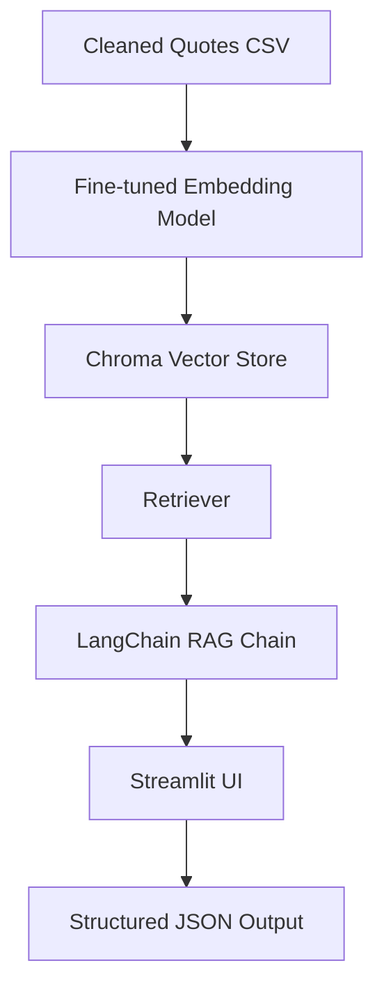

# 🧠 QuoteBot: Context-Aware Quote Retrieval RAG App

> A semantic quote retrieval system powered by a fine-tuned SentenceTransformer embedding model, ChromaDB, and Groq's LLaMA3-70B via LangChain — all served in a friendly Streamlit UI.

---

## 🚀 Project Summary

QuoteBot is an end-to-end Retrieval-Augmented Generation (RAG) application that allows users to retrieve insightful quotes based on natural language queries. It uses a custom fine-tuned all-MiniLM-L6-v2 - embedding model for accurate semantic understanding and Groq's blazing-fast LLaMA3 models to generate structured outputs.

---

## 🔁 Workflow Overview



### Components:

* **Embedding Model**: Fine-tuned on semantic alignment between quotes, tags, and authors using SentenceTransformer.
* **Vector DB**: ChromaDB stores quote vectors for fast similarity retrieval.
* **Retriever**: Queries top-k similar quotes based on user input.
* **LLM**: Groq-hosted LLaMA3 generates strictly formatted JSON responses.
* **UI**: Streamlit interface for real-time interaction and quote download.

---

## 💻 How to Run Locally

### 1. Clone the Repository

```bash
git clone https://github.com/jatinydav557/fine-tuned-model-RAG-ChromaDb.git
cd quotebot-rag
```

### 2. Install Dependencies (with `uv`)

> This project uses [`uv`](https://github.com/astral-sh/uv) for lightning-fast environment setup.

```bash
pip install pipx
pipx install uv
uv venv
uv pip install -r requirements.txt
```

### 3. Prepare Environment Variables

Create a `.env` file and add your [Groq API key](https://console.groq.com/):

```env
GROQ_API_KEY=your_groq_api_key_here
```

### 4. Add Vector Store & Model

Place the following in the root directory:

* `Chroma_db/` → Precomputed vector database (from `quotes.csv`)
* `finetune/fine-tuned-model-rag/` → Your fine-tuned SentenceTransformer model

### 5. Launch the App

```bash
python app.py
```

Navigate to `http://localhost:7860` to use the app.

---

## 📄 Dataset Format (quotes.csv)

Ensure your CSV has the following columns:

| quote            | author      | tags                              |
| ---------------- | ----------- | --------------------------------- |
| "Be yourself..." | Oscar Wilde | \["be-yourself", "inspirational"] |

---

## 🧪 Model Evaluation

Evaluation is performed using [`ragas`](https://github.com/explodinggradients/ragas), measuring:

* Faithfulness
* Answer Relevancy
* Context Precision & Recall

The model is tested on custom evaluation sets and gives detailed metrics via:

```python
from ragas.evaluation import evaluate
results = evaluate(dataset, metrics=[...], llm=llm, embeddings=embedding)
```

---

## 🧠 Fine-Tuning Embedding Model

> Using SentenceTransformers on quote-author-tag pairs

```python
InputExample(texts=["quote", "tags author"], label=1.0)
```

* Loss: `CosineSimilarityLoss`
* Pretrained base: `all-MiniLM-L6-v2`
* Optimizer: AdamW (lr=2e-5)

---

## 📦 Dependencies

```txt
transformers
sentence-transformers
datasets
langchain
langchain-chroma
langchain-groq
langchain-huggingface
chromadb
huggingface-hub
ragas
streamlit
python-dotenv
pandas
torch
tqdm
evaluate
```


## 🤝 Acknowledgements

* Assignment provided by **Vijayi WFH Technologies Pvt Ltd**
---

